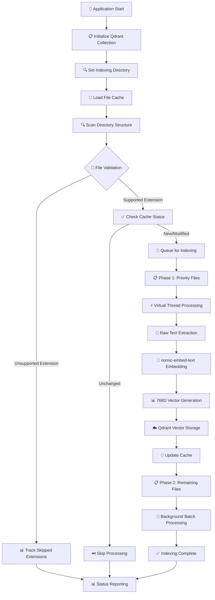
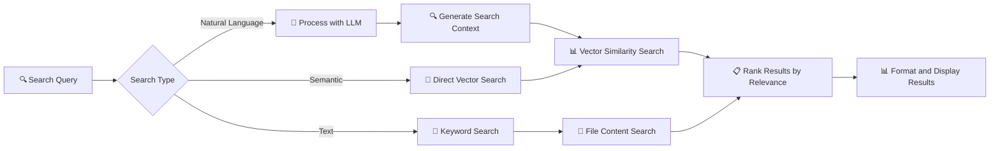

# Misoto Codebase Indexer

An AI-powered terminal application for intelligent code search and indexing using Spring AI and vector databases.

## Features

- 🔍 **Natural Language Search**: Search code using plain English queries
- 🧠 **Semantic Search**: Find conceptually similar code using AI embeddings
- 📝 **Text Search**: Traditional keyword-based search
- ⚙️ **Advanced Search**: Filter by file type, language, repository
- 📚 **Intelligent Indexing**: AI-powered code analysis and indexing
- 📊 **Detailed Status Tracking**: Real-time indexing progress and file type statistics
- 💾 **Persistent Caching**: Avoids re-indexing unchanged files
- 🔄 **Background Processing**: Non-blocking indexing with immediate search availability

## 🔄 Application Logic Flow

### **Hybrid Indexing Pipeline**



### **Embedding Flow Architecture**

```
📄 Raw Text (from source files)
    ↓
🤖 nomic-embed-text (Ollama embedding model - 768 dimensions)  
    ↓
📊 Vector Representation (768-dimensional float array)
    ↓
☁️ Qdrant Cloud (vector database storage with metadata)
```

### **File Processing Strategy**

#### **Priority-Based Indexing**
1. **Phase 1 - Critical Files (Priority 1-5):**
   - Controllers (`*Controller.java`) - Priority 1
   - Services (`*Service.java`) - Priority 2  
   - Repositories (`*Repository.java`) - Priority 3
   - Configuration (`*Config.java`) - Priority 4
   - Applications (`*Application.java`) - Priority 5

2. **Phase 2 - Background Processing:**
   - All remaining supported files
   - Processed in batches using virtual threads
   - Non-blocking execution

#### **Supported File Extensions**

| Category | Extensions | Purpose |
|----------|------------|---------|
| **Java Ecosystem** | `.java`, `.xml`, `.properties`, `.yml`, `.yaml`, `.json` | Core application files |
| **Documentation** | `.md`, `.txt`, `.st`, `.adoc` | Project documentation |
| **JVM Languages** | `.kt`, `.scala` | Kotlin and Scala source |
| **Database** | `.sql`, `.cql` | Database schemas and queries |
| **Web Technologies** | `.html`, `.css`, `.js`, `.jsp`, `.asp`, `.aspx`, `.php` | Frontend and web components |
| **System Scripts** | `.conf`, `.cmd`, `.sh` | Configuration and automation |
| **Programming Languages** | `.py`, `.c`, `.cpp`, `.cs`, `.rb`, `.vb`, `.go`, `.swift`, `.lua`, `.pl`, `.r` | Multi-language support |
| **Documents** | `.pdf` | Documentation and specs |

### **Search Execution Flow**



### **Performance Optimizations**

- **Virtual Threads**: Concurrent processing for I/O-intensive operations
- **Persistent Cache**: Tracks file modification times to avoid re-indexing
- **Batch Processing**: Groups files for efficient processing
- **Priority Queuing**: Critical files indexed first for immediate search availability
- **Smart Chunking**: Large files split into manageable 3KB chunks with 500-character overlap
- **Background Execution**: Indexing runs asynchronously without blocking the CLI

### **Status Tracking & Metrics**

The application provides comprehensive real-time metrics:

- **📊 Progress**: Indexed vs. total files percentage
- **⏱️ Timing**: Current duration, estimated completion time
- **🚀 Performance**: Files per second processing speed
- **🧵 Threading**: Active and peak virtual thread usage
- **📄 File Types**: Breakdown by extension and count
- **⚠️ Issues**: Failed and skipped file counts
- **🚫 Skipped Extensions**: Non-supported file types encountered

## Prerequisites

- Java 17+
- Maven 3.8+
- Ollama (for local AI models)
- Qdrant Cloud cluster (for vector search)

## 🤖 Ollama Model Setup

This application uses specialized AI models for embeddings and chat:

### Required Models:
- **nomic-embed-text**: High-quality embedding model (768 dimensions)
- **codellama:7b**: Code-aware chat model for intelligent analysis

### Quick Setup:
```bash
# Run the setup script (Windows)
setup-models.bat

# Or run manually:
ollama pull nomic-embed-text
ollama pull codellama:7b
```

### Linux/Mac Setup:
```bash
# Make script executable and run
chmod +x setup-models.sh
./setup-models.sh
```

### Why nomic-embed-text?
- **Optimized for text**: Better semantic understanding than code-specific models for embeddings
- **Efficient**: 768-dimensional vectors (vs 4096 for CodeLlama)
- **Fast**: Quicker indexing and search operations
- **Quality**: High-quality embeddings for code and documentation

## ☁️ Qdrant Cloud Setup

1. **Create Qdrant Cloud Account:**
   - Go to [https://cloud.qdrant.io/](https://cloud.qdrant.io/)
   - Sign up for a free account (includes 1GB storage)

2. **Create a Cluster:**
   - Click "Create Cluster"
   - Choose your preferred region
   - Select the free tier
   - Wait for cluster deployment

3. **Get Connection Details:**
   - Copy your cluster URL (e.g., `https://xyz-123.qdrant.tech`)
   - Generate an API key from the dashboard

4. **Update Configuration:**
   ```properties
   # In src/main/resources/application.properties
   spring.ai.vectorstore.qdrant.host=xyz-123.qdrant.tech
   spring.ai.vectorstore.qdrant.api-key=your-generated-api-key
   ```

## 🚀 Quick Start Summary

1. **Install Ollama**
   ```bash
   # Download and install Ollama from https://ollama.ai
   # Or use curl (Linux/macOS):
   curl -fsSL https://ollama.ai/install.sh | sh
   ```

2. **Pull CodeLlama Model**
   ```bash
   ollama pull codellama:7b
   ```

3. **Clone and Build**
   ```bash
   git clone <repository-url>
   cd misoto-indexer
   mvn clean compile
   ```

4. **Configure Environment Variables**
   ```bash
   # Copy the environment template
   cp .env.example .env
   
   # Edit .env with your Qdrant Cloud details
   # Update QDRANT_HOST and QDRANT_API_KEY
   ```

5. **Run the Application**
   ```bash
   mvn spring-boot:run
   ```

## Usage

### Getting Started

1. **Start the Application:**
   ```bash
   mvn spring-boot:run
   ```

2. **Wait for Initialization:**
   - The application will initialize Qdrant collection
   - Background indexing starts automatically
   - CLI menu appears immediately (indexing runs in background)

3. **Begin Searching:**
   - Search is available even while indexing is in progress
   - Priority files (Controllers, Services) are indexed first for immediate results

### Interactive CLI Menu

When you run the application, you'll see an interactive menu:

```
╔══════════════════════════════════════════════════════════════╗
║                    MISOTO CODEBASE INDEXER                  ║
║                   Intelligent Code Search                   ║
╚══════════════════════════════════════════════════════════════╝

┌─────────────────── SEARCH MENU ───────────────────┐
│ 1. 🔍 Search with Natural Language Prompt         │
│ 2. 📊 Indexing Status                            │
│ 3. 🧠 Semantic Code Search                        │
│ 4. 📝 Text Search                                 │
│ 5. ⚙️  Advanced Search                            │
│ 6. 📚 Index Codebase                             │
│ 7. ❓ Help                                        │
│ 0. 🚪 Exit                                        │
└───────────────────────────────────────────────────┘
```

### Detailed Menu Options

#### **1. 🔍 Natural Language Search**
Use conversational queries to find code with AI assistance:

**Example Queries:**
```
🔍 Search Query: Find authentication logic
🔍 Search Query: Show me REST API endpoints for user management  
🔍 Search Query: Classes that implement caching
🔍 Search Query: Database connection configuration
🔍 Search Query: Error handling middleware
🔍 Search Query: JWT token validation
```

**How it works:**
- AI processes your natural language intent
- Converts to optimized search terms
- Returns ranked results with relevance scores
- Shows code snippets with context

#### **2. 📊 Indexing Status**
Monitor real-time indexing progress and system performance:

```
╔═════════════════ INDEXING STATUS ═════════════════╗
║ 📊 Progress: 1,247 / 2,150 files (58.0%)         ║
║ ⏱️  Duration: 45s | Estimated: 78s remaining      ║
║ 🚀 Speed: 27.7 files/second                      ║
║ 🧵 Threads: 8 active, 12 peak                    ║
║                                                   ║
║ 📄 File Types Indexed:                           ║
║   • .java: 423 files                             ║
║   • .xml: 156 files                              ║
║   • .properties: 89 files                        ║
║   • .md: 67 files                                ║
║   • .kt: 45 files                                ║
║                                                   ║
║ 🚫 Skipped Extensions: .class (234), .jar (12)   ║
║ ⚠️  Failed: 3 files | Skipped: 456 files         ║
╚═══════════════════════════════════════════════════╝
```

**Status Information:**
- **Progress**: Percentage of files processed
- **Performance**: Files per second processing speed
- **Threading**: Virtual thread usage for optimal performance
- **File Breakdown**: Count by file type/extension
- **Issues**: Failed and skipped file tracking

#### **3. 🧠 Semantic Code Search**
Find conceptually similar code using vector embeddings:

**Example Usage:**
```
🧠 Enter search query: database repository pattern
🎯 Similarity threshold (0.0-1.0) [0.7]: 0.8
🔍 Max results [10]: 5

📊 Found 5 results (similarity > 0.8):

1. UserRepository.java (0.92) - Line 23
   @Repository
   public class UserRepository extends JpaRepository<User, Long> {
       Optional<User> findByUsername(String username);
   }

2. ProductService.java (0.89) - Line 45
   private final ProductRepository productRepository;
   
3. OrderRepository.java (0.85) - Line 12
   public interface OrderRepository extends CrudRepository<Order, UUID> {
```

**Features:**
- Adjustable similarity threshold (0.0 to 1.0)
- Vector-based semantic matching
- Ranked results by relevance score
- Context-aware code snippets

#### **4. 📝 Text Search**
Fast keyword-based search across all indexed files:

**Example Usage:**
```
📝 Enter search term: @RestController
🔍 Case sensitive? [y/N]: n
📊 Max results [20]: 10

📊 Found 8 matches in 6 files:

1. UserController.java - Line 15
   @RestController
   @RequestMapping("/api/users")
   public class UserController {

2. AuthController.java - Line 12
   @RestController
   @RequestMapping("/api/auth") 
   public class AuthController {
```

**Search Options:**
- Case-sensitive or insensitive matching
- Regular expression support
- File path filtering
- Configurable result limits

#### **5. ⚙️ Advanced Search**
Combine multiple search criteria for precise results:

**Filter Options:**
```
⚙️ Advanced Search Configuration:
📁 File extensions: .java,.kt,.scala
🏷️  File name pattern: *Service*
📂 Directory filter: src/main/java
🔍 Content contains: @Transactional
📏 File size: 1KB - 100KB
📅 Modified after: 2024-01-01
```

**Example Results:**
```
📊 Advanced Search Results (12 matches):

Filters Applied:
✅ Extensions: .java, .kt
✅ Pattern: *Service*  
✅ Content: @Transactional
✅ Directory: src/main/java

1. UserService.java (src/main/java/service/)
   @Transactional
   public void updateUser(User user) { ... }

2. OrderService.kt (src/main/java/service/)
   @Transactional
   fun processOrder(order: Order) { ... }
```

#### **6. 📚 Index Codebase**
Start or restart the indexing process:

**Options:**
```
📚 Codebase Indexing Options:

1. 🔄 Restart indexing (current directory)
2. 📁 Change indexing directory
3. 🗑️  Clear cache and reindex all files
4. ⏸️  Pause/Resume indexing
5. 📊 View indexing statistics

Current directory: /path/to/project/src
Indexed files: 1,247 | Cache entries: 1,189
```

**Directory Selection:**
```
📁 Select indexing directory:
   Current: /project/src
   
1. 📂 /project/src (current)
2. 📂 /project/src/main/java
3. 📂 /project/codebase
4. 📝 Enter custom path
5. 🔙 Back to main menu

Enter choice [1-5]:
```

#### **7. ❓ Help**
Comprehensive help and documentation:

```
╔═══════════════════ HELP & TIPS ═══════════════════╗
║                                                   ║
║ 🔍 SEARCH TIPS:                                   ║
║   • Use specific terms: "JWT authentication"     ║
║   • Try different phrasings if no results        ║
║   • Combine keywords: "user repository database" ║
║                                                   ║
║ 🎯 SIMILARITY THRESHOLDS:                         ║
║   • 0.9-1.0: Very similar (exact matches)        ║
║   • 0.7-0.9: Similar (related concepts)          ║
║   • 0.5-0.7: Somewhat related                    ║
║   • 0.0-0.5: Loose associations                  ║
║                                                   ║
║ 📁 SUPPORTED FILE TYPES:                          ║
║   • Code: .java, .kt, .scala, .py, .js, .ts     ║
║   • Config: .xml, .yml, .properties, .json      ║
║   • Web: .html, .css, .jsp, .php                ║
║   • Docs: .md, .txt, .adoc                      ║
║   • Scripts: .sh, .cmd, .sql                    ║
║                                                   ║
║ ⚡ PERFORMANCE:                                    ║
║   • Search available during indexing             ║
║   • Priority files indexed first                 ║
║   • Background processing uses virtual threads   ║
║   • Cache prevents re-indexing unchanged files   ║
║                                                   ║
╚═══════════════════════════════════════════════════╝
```

### Search Examples & Best Practices

#### **Natural Language Search Examples**

| Query Type | Example | What it finds |
|------------|---------|---------------|
| **Functionality** | "user authentication" | Login methods, auth filters, JWT handling |
| **Architecture** | "repository pattern" | Data access objects, JPA repositories |
| **Error Handling** | "exception handling" | Try-catch blocks, error controllers |
| **Configuration** | "database configuration" | DataSource beans, connection properties |
| **API Endpoints** | "REST endpoints for users" | UserController methods, API routes |
| **Security** | "authorization logic" | Security configs, role-based access |

#### **Semantic Search Best Practices**

- **High Similarity (0.8-1.0)**: Find exact patterns and implementations
- **Medium Similarity (0.6-0.8)**: Find related concepts and similar logic
- **Low Similarity (0.4-0.6)**: Explore loosely related code
- **Use specific technical terms**: "repository", "controller", "service"
- **Combine concepts**: "user authentication JWT token"

#### **Text Search Tips**

- **Class names**: `UserService`, `@RestController`
- **Method names**: `findByUsername`, `authenticate`
- **Annotations**: `@Transactional`, `@Autowired`
- **Patterns**: Use wildcards like `find*` or `*Controller`
- **Regular expressions**: Enable regex for complex patterns

### Workflow Examples

#### **Example 1: Finding Authentication Code**
```
1. Start with Natural Language: "user authentication"
2. Review results, note relevant classes
3. Use Semantic Search: "JWT token validation" (similarity: 0.7)
4. Drill down with Text Search: "@PreAuthorize"
5. Use Advanced Search: Files containing "auth" in src/main/java
```

#### **Example 2: Understanding Data Access Layer**
```
1. Natural Language: "database repository pattern"
2. Semantic Search: "JPA repository" (similarity: 0.8)
3. Text Search: "extends JpaRepository"
4. Advanced Search: Filter by *.java files containing "@Repository"
```

#### **Example 3: API Endpoint Discovery**
```
1. Natural Language: "REST API endpoints"
2. Text Search: "@RestController"
3. Semantic Search: "HTTP GET POST endpoints" (similarity: 0.7)
4. Advanced Search: Files matching "*Controller.java"
```

### Performance & Monitoring

- **Real-time Status**: Check option 2 for live indexing progress
- **Search During Indexing**: Search works immediately, even while indexing
- **Cache Management**: System automatically manages file change detection
- **Background Processing**: Indexing doesn't block the interactive menu
- **Memory Efficient**: Virtual threads optimize resource usage

## Development

### Project Structure
```
src/main/java/sg/edu/nus/iss/codebase/indexer/
├── IndexerApplication.java          # Main Spring Boot application
├── cli/
│   └── SearchCLI.java              # Interactive command-line interface
├── config/
│   ├── EnvironmentConfig.java      # Environment variable configuration
│   ├── QdrantCollectionInitializer.java # Vector database setup
│   └── VirtualThreadConfig.java    # Async processing configuration
├── controller/
│   └── SearchController.java       # REST API endpoints (optional)
├── dto/
│   └── SearchRequest.java          # Data transfer objects
└── service/
    ├── FileSearchService.java      # File-based search implementation
    ├── HybridSearchService.java    # Main search orchestration
    └── IndexingService.java        # Core indexing logic and vector processing
```

### Key Components

#### **IndexingService.java**
- **Core indexing engine** with hybrid pipeline
- **Vector embedding** using nomic-embed-text (768D)
- **Persistent caching** with modification time tracking
- **Priority-based processing** for critical files first
- **Virtual thread pool** for concurrent I/O operations
- **Comprehensive metrics** tracking and reporting

#### **HybridSearchService.java**
- **Multi-modal search** (semantic, text, natural language)
- **Result ranking** and relevance scoring
- **Search orchestration** across different backends
- **Performance optimization** with caching strategies

#### **SearchCLI.java**
- **Interactive terminal interface** with real-time updates
- **Status monitoring** with detailed progress visualization
- **User experience** optimized for developer workflows
- **Background processing** with responsive menu system

### Architecture Highlights

#### **Asynchronous Processing**
```java
@Async("indexingExecutor")
public CompletableFuture<Void> indexPriorityFilesAsync() {
    // Priority files processed first for immediate search availability
}

@Async("virtualThreadExecutor") 
public CompletableFuture<Void> indexRemainingFilesAsync() {
    // Background processing using virtual threads
}
```

#### **Intelligent Caching**
```java
// Persistent cache tracks file modification times
private final Map<String, Long> fileModificationTimes = new ConcurrentHashMap<>();

private boolean needsReindexing(File file) {
    // Only reindex if file is new or modified
    return !indexedFilePaths.contains(filePath) || 
           currentModTime != cachedModTime;
}
```

#### **Vector Pipeline**
```java
// Raw Text → Embedding → Vector → Storage
List<Document> documents = createDocumentsFromFile(file);
vectorStore.add(documents); // nomic-embed-text → 768D vector → Qdrant
```

## Configuration

### Vector Database Setup (Qdrant Cloud)

1. **Create a Qdrant Cloud Account:**
   - Visit [Qdrant Cloud](https://cloud.qdrant.io/)
   - Sign up for a free account
   - Create a new cluster

2. **Get Your Cluster Details:**
   ```bash
   # Your cluster URL will look like:
   # https://your-cluster-id.qdrant.tech:6333
   ```

3. **Configure the Application:**
   ```properties
   # In application.properties
   spring.ai.vectorstore.qdrant.host=your-cluster-id.qdrant.tech
   spring.ai.vectorstore.qdrant.port=6333
   spring.ai.vectorstore.qdrant.use-tls=true
   spring.ai.vectorstore.qdrant.api-key=your-api-key-here
   spring.ai.vectorstore.qdrant.collection-name=codebase-index
   ```

4. **Create Collection (Optional):**
   The application will automatically create the collection if it doesn't exist.

### AI Model Configuration

The application uses Ollama for local AI processing with CodeLlama:

```properties
# Ollama Configuration
spring.ai.ollama.base-url=http://localhost:11434
spring.ai.ollama.chat.options.model=codellama:7b
spring.ai.ollama.embedding.options.model=codellama:7b
```

**Available Models:**
- `codellama:7b` - 7B parameter CodeLlama model (recommended)
- `codellama:13b` - 13B parameter model (better quality, slower)
- `codellama:34b` - 34B parameter model (best quality, slowest)

**Install different models:**
```bash
ollama pull codellama:13b
ollama pull codellama:34b
```

## Contributing

1. Fork the repository
2. Create a feature branch
3. Make your changes
4. Add tests
5. Submit a pull request

## License

This project is licensed under the MIT License - see the LICENSE file for details.

## Support

For issues and questions:
- Create an issue on GitHub
- Check the documentation
- Review the help menu in the application (option 6)
