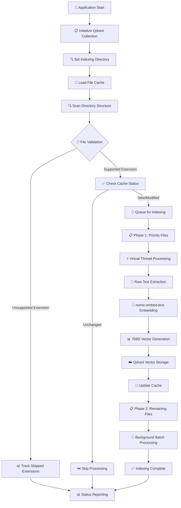
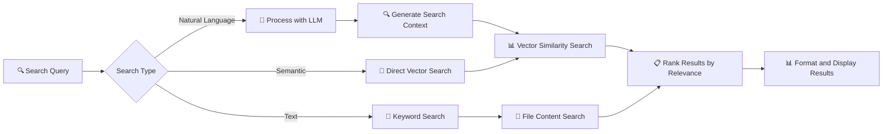

# Misoto Codebase Indexer

An AI-powered terminal application for intelligent code search and indexing using Spring AI and vector databases.

#4. **Configure the Application:**
   ```bash
   # Copy environment template
   cp .env.example .env
   
   # Edit .env file with your cluster details
   QDRANT_HOST=your-cluster-id.qdrant.tech
   QDRANT_API_KEY=your-api-key-here
   ```s

- 🔍 **Natural Language Search**: Search code using plain English queries
- 🧠 **Semantic Search**: Find conceptually similar code using AI embeddings
- 📝 **Text Search**: Traditional keyword-based search
- ⚙️ **Advanced Search**: Filter by file type, language, repository
- 📚 **Intelligent Indexing**: AI-powered code analysis and indexing
- 📊 **Detailed Status Tracking**: Real-time indexing progress and file type statistics
- 💾 **Persistent Caching**: Avoids re-indexing unchanged files
- 🔄 **Background Processing**: Non-blocking indexing with immediate search availability

## 🔄 Application Logic Flow

### **Hybrid Indexing Pipeline**



### **Embedding Flow Architecture**

```
📄 Raw Text (from source files)
    ↓
🤖 nomic-embed-text (Ollama embedding model - 768 dimensions)  
    ↓
📊 Vector Representation (768-dimensional float array)
    ↓
☁️ Qdrant Cloud (vector database storage with metadata)
```

### **File Processing Strategy**

#### **Priority-Based Indexing**
1. **Phase 1 - Critical Files (Priority 1-5):**
   - Controllers (`*Controller.java`) - Priority 1
   - Services (`*Service.java`) - Priority 2  
   - Repositories (`*Repository.java`) - Priority 3
   - Configuration (`*Config.java`) - Priority 4
   - Applications (`*Application.java`) - Priority 5

2. **Phase 2 - Background Processing:**
   - All remaining supported files
   - Processed in batches using virtual threads
   - Non-blocking execution

#### **Supported File Extensions**

| Category | Extensions | Purpose |
|----------|------------|---------|
| **Java Ecosystem** | `.java`, `.xml`, `.properties`, `.yml`, `.yaml`, `.json` | Core application files |
| **Documentation** | `.md`, `.txt`, `.st`, `.adoc` | Project documentation |
| **JVM Languages** | `.kt`, `.scala` | Kotlin and Scala source |
| **Database** | `.sql`, `.cql` | Database schemas and queries |
| **Web Technologies** | `.html`, `.css`, `.js`, `.jsp`, `.asp`, `.aspx`, `.php` | Frontend and web components |
| **System Scripts** | `.conf`, `.cmd`, `.sh` | Configuration and automation |
| **Programming Languages** | `.py`, `.c`, `.cpp`, `.cs`, `.rb`, `.vb`, `.go`, `.swift`, `.lua`, `.pl`, `.r` | Multi-language support |
| **Documents** | `.pdf` | Documentation and specs |

### **Search Execution Flow**



### **Performance Optimizations**

- **Virtual Threads**: Concurrent processing for I/O-intensive operations
- **Persistent Cache**: Tracks file modification times to avoid re-indexing
- **Batch Processing**: Groups files for efficient processing
- **Priority Queuing**: Critical files indexed first for immediate search availability
- **Smart Chunking**: Large files split into manageable 3KB chunks with 500-character overlap
- **Background Execution**: Indexing runs asynchronously without blocking the CLI

### **Status Tracking & Metrics**

The application provides comprehensive real-time metrics:

- **📊 Progress**: Indexed vs. total files percentage
- **⏱️ Timing**: Current duration, estimated completion time
- **🚀 Performance**: Files per second processing speed
- **🧵 Threading**: Active and peak virtual thread usage
- **📄 File Types**: Breakdown by extension and count
- **⚠️ Issues**: Failed and skipped file counts
- **🚫 Skipped Extensions**: Non-supported file types encountered

## Prerequisites

- Java 17+
- Maven 3.8+
- Ollama (for local AI models)
- Qdrant Cloud cluster (for vector search)

## 🤖 Ollama Model Setup

This application uses specialized AI models for embeddings and chat:

### Required Models:
- **nomic-embed-text**: High-quality embedding model (768 dimensions)
- **codellama:7b**: Code-aware chat model for intelligent analysis

### Quick Setup:
```bash
# Run the setup script (Windows)
setup-models.bat

# Or run manually:
ollama pull nomic-embed-text
ollama pull codellama:7b
```

### Linux/Mac Setup:
```bash
# Make script executable and run
chmod +x setup-models.sh
./setup-models.sh
```

### Why nomic-embed-text?
- **Optimized for text**: Better semantic understanding than code-specific models for embeddings
- **Efficient**: 768-dimensional vectors (vs 4096 for CodeLlama)
- **Fast**: Quicker indexing and search operations
- **Quality**: High-quality embeddings for code and documentation

## ☁️ Qdrant Cloud Setup

1. **Create Qdrant Cloud Account:**
   - Go to [https://cloud.qdrant.io/](https://cloud.qdrant.io/)
   - Sign up for a free account (includes 1GB storage)

2. **Create a Cluster:**
   - Click "Create Cluster"
   - Choose your preferred region
   - Select the free tier
   - Wait for cluster deployment

3. **Get Connection Details:**
   - Copy your cluster URL (e.g., `https://xyz-123.qdrant.tech`)
   - Generate an API key from the dashboard

4. **Update Configuration:**
   ```properties
   # In src/main/resources/application.properties
   spring.ai.vectorstore.qdrant.host=xyz-123.qdrant.tech
   spring.ai.vectorstore.qdrant.api-key=your-generated-api-key
   ```

## 🚀 Quick Start Summary

1. **Install Ollama**
   ```bash
   # Download and install Ollama from https://ollama.ai
   # Or use curl (Linux/macOS):
   curl -fsSL https://ollama.ai/install.sh | sh
   ```

2. **Pull CodeLlama Model**
   ```bash
   ollama pull codellama:7b
   ```

3. **Clone and Build**
   ```bash
   git clone <repository-url>
   cd misoto-indexer
   mvn clean compile
   ```

4. **Configure Environment Variables**
   ```bash
   # Copy the environment template
   cp .env.example .env
   
   # Edit .env with your Qdrant Cloud details
   # Update QDRANT_HOST and QDRANT_API_KEY
   ```

5. **Run the Application**
   ```bash
   mvn spring-boot:run
   ```

## Usage

When you run the application, you'll see an interactive menu:

```
╔══════════════════════════════════════════════════════════════╗
║                    MISOTO CODEBASE INDEXER                  ║
║                   Intelligent Code Search                   ║
╚══════════════════════════════════════════════════════════════╝

┌─────────────────── SEARCH MENU ───────────────────┐
│ 1. 🔍 Search with Natural Language Prompt         │
│ 2. 📊 Indexing Status                            │
│ 3. 🧠 Semantic Code Search                        │
│ 4. 📝 Text Search                                 │
│ 5. ⚙️  Advanced Search                            │
│ 6. 📚 Index Codebase                             │
│ 7. ❓ Help                                        │
│ 0. 🚪 Exit                                        │
└───────────────────────────────────────────────────┘
```

### Menu Options

**1. 🔍 Natural Language Search:**
- Search using conversational queries like "Find authentication logic"
- AI processes your intent and searches relevant code

**2. 📊 Indexing Status:**
- View detailed real-time indexing progress
- See file type breakdown, processing speed, thread usage
- Monitor skipped file extensions and error counts

**3. 🧠 Semantic Code Search:**
- Find conceptually similar code patterns
- Adjustable similarity threshold for precision control

**4. 📝 Text Search:**
- Traditional keyword-based search across all indexed files
- Fast and precise for known terms and identifiers

**5. ⚙️ Advanced Search:**
- Filter results by file types, languages, or specific criteria
- Combine multiple search parameters

**6. 📚 Index Codebase:**
- Start or restart the indexing process
- Set custom directory paths for targeted indexing

### Sample Indexing Status Output

```
╔═════════════════ INDEXING STATUS ═════════════════╗
║ 📊 Progress: 1,247 / 2,150 files (58.0%)         ║
║ ⏱️  Duration: 45s | Estimated: 78s remaining      ║
║ 🚀 Speed: 27.7 files/second                      ║
║ 🧵 Threads: 8 active, 12 peak                    ║
║                                                   ║
║ 📄 File Types Indexed:                           ║
║   • .java: 423 files                             ║
║   • .xml: 156 files                              ║
║   • .properties: 89 files                        ║
║   • .md: 67 files                                ║
║   • .kt: 45 files                                ║
║                                                   ║
║ 🚫 Skipped Extensions: .class (234), .jar (12)   ║
║ ⚠️  Failed: 3 files | Skipped: 456 files         ║
╚═══════════════════════════════════════════════════╝
```

### Search Examples

**Natural Language Search:**
- "Find functions that handle user authentication"
- "Show me REST API endpoints for user management"
- "Find classes that implement caching logic"

**Semantic Search:**
- Search for code patterns similar to your query
- Adjustable similarity threshold (0.0 to 1.0)

**Text Search:**
- Traditional keyword search in code files
- Fast and precise for known terms

**Advanced Search:**
- Filter by file types (java, js, py, etc.)
- Filter by programming languages
- Repository-specific search

## Development

### Project Structure
```
src/main/java/sg/edu/nus/iss/codebase/indexer/
├── IndexerApplication.java          # Main Spring Boot application
├── cli/
│   └── SearchCLI.java              # Interactive command-line interface
├── config/
│   ├── EnvironmentConfig.java      # Environment variable configuration
│   ├── QdrantCollectionInitializer.java # Vector database setup
│   └── VirtualThreadConfig.java    # Async processing configuration
├── controller/
│   └── SearchController.java       # REST API endpoints (optional)
├── dto/
│   └── SearchRequest.java          # Data transfer objects
└── service/
    ├── FileSearchService.java      # File-based search implementation
    ├── HybridSearchService.java    # Main search orchestration
    └── IndexingService.java        # Core indexing logic and vector processing
```

### Key Components

#### **IndexingService.java**
- **Core indexing engine** with hybrid pipeline
- **Vector embedding** using nomic-embed-text (768D)
- **Persistent caching** with modification time tracking
- **Priority-based processing** for critical files first
- **Virtual thread pool** for concurrent I/O operations
- **Comprehensive metrics** tracking and reporting

#### **HybridSearchService.java**
- **Multi-modal search** (semantic, text, natural language)
- **Result ranking** and relevance scoring
- **Search orchestration** across different backends
- **Performance optimization** with caching strategies

#### **SearchCLI.java**
- **Interactive terminal interface** with real-time updates
- **Status monitoring** with detailed progress visualization
- **User experience** optimized for developer workflows
- **Background processing** with responsive menu system

### Architecture Highlights

#### **Asynchronous Processing**
```java
@Async("indexingExecutor")
public CompletableFuture<Void> indexPriorityFilesAsync() {
    // Priority files processed first for immediate search availability
}

@Async("virtualThreadExecutor") 
public CompletableFuture<Void> indexRemainingFilesAsync() {
    // Background processing using virtual threads
}
```

#### **Intelligent Caching**
```java
// Persistent cache tracks file modification times
private final Map<String, Long> fileModificationTimes = new ConcurrentHashMap<>();

private boolean needsReindexing(File file) {
    // Only reindex if file is new or modified
    return !indexedFilePaths.contains(filePath) || 
           currentModTime != cachedModTime;
}
```

#### **Vector Pipeline**
```java
// Raw Text → Embedding → Vector → Storage
List<Document> documents = createDocumentsFromFile(file);
vectorStore.add(documents); // nomic-embed-text → 768D vector → Qdrant
```

## Configuration

### Vector Database Setup (Qdrant Cloud)

1. **Create a Qdrant Cloud Account:**
   - Visit [Qdrant Cloud](https://cloud.qdrant.io/)
   - Sign up for a free account
   - Create a new cluster

2. **Get Your Cluster Details:**
   ```bash
   # Your cluster URL will look like:
   # https://your-cluster-id.qdrant.tech:6333
   ```

3. **Configure the Application:**
   ```properties
   # In application.properties
   spring.ai.vectorstore.qdrant.host=your-cluster-id.qdrant.tech
   spring.ai.vectorstore.qdrant.port=6333
   spring.ai.vectorstore.qdrant.use-tls=true
   spring.ai.vectorstore.qdrant.api-key=your-api-key-here
   spring.ai.vectorstore.qdrant.collection-name=codebase-index
   ```

4. **Create Collection (Optional):**
   The application will automatically create the collection if it doesn't exist.

### AI Model Configuration

The application uses Ollama for local AI processing with CodeLlama:

```properties
# Ollama Configuration
spring.ai.ollama.base-url=http://localhost:11434
spring.ai.ollama.chat.options.model=codellama:7b
spring.ai.ollama.embedding.options.model=codellama:7b
```

**Available Models:**
- `codellama:7b` - 7B parameter CodeLlama model (recommended)
- `codellama:13b` - 13B parameter model (better quality, slower)
- `codellama:34b` - 34B parameter model (best quality, slowest)

**Install different models:**
```bash
ollama pull codellama:13b
ollama pull codellama:34b
```

## Contributing

1. Fork the repository
2. Create a feature branch
3. Make your changes
4. Add tests
5. Submit a pull request

## License

This project is licensed under the MIT License - see the LICENSE file for details.

## Support

For issues and questions:
- Create an issue on GitHub
- Check the documentation
- Review the help menu in the application (option 6)
